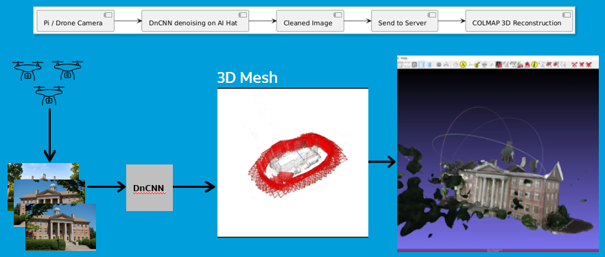
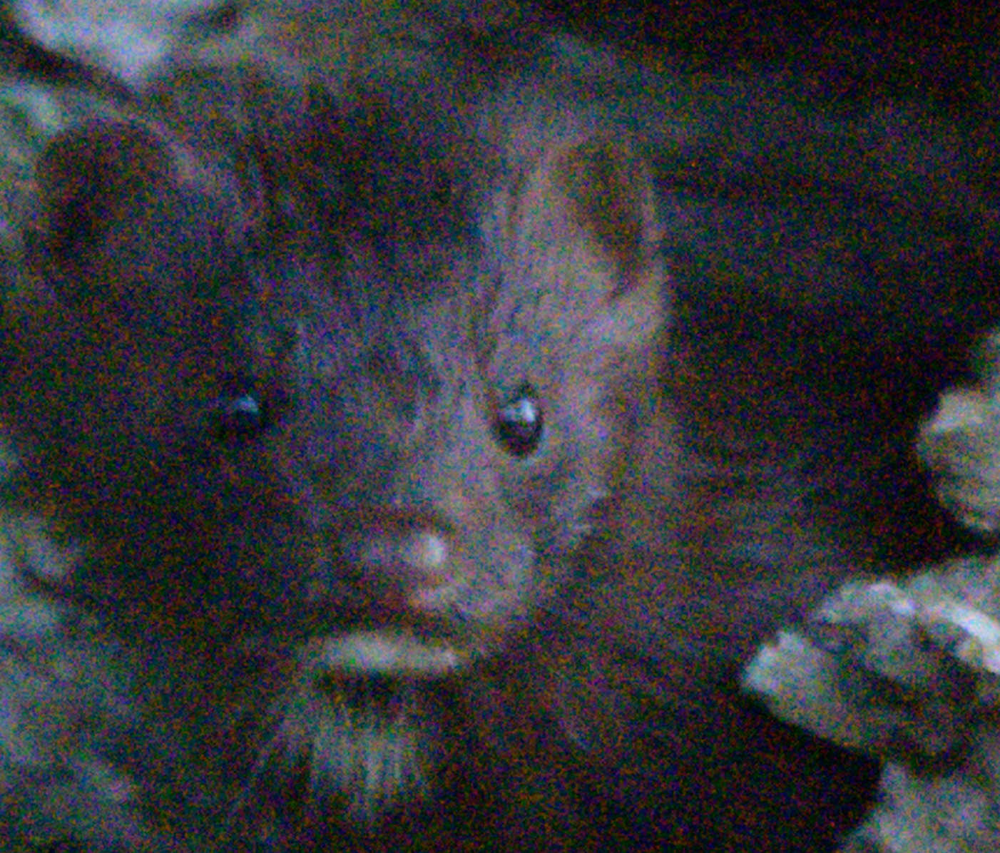

## About
This project was developed for a hackathon to create detailed 3D terrain maps of disaster zones using advanced photogrammetry techniques. Leveraging COLMAP, the system reconstructs high-resolution 3D models from aerial imagery captured by a coordinated drone swarm. Before processing, images are enhanced using an image denoising CNN (DnCNN) model to optimize feature extraction. The denoised images are then transmitted via the AT&T network to a server equipped with CUDA GPU acceleration, where COLMAP generates the final 3D renders.

Beyond disaster response, this technology has versatile business applications, including:

- **3D Modeling of Cell Towers and Equipment:** Enabling precise asset management and inspection.
- **Small Cell Deployment in Urban Areas:** Facilitating optimal placement and planning through detailed urban terrain mapping.
- **Disaster Recovery:** Providing first responders with rapid and accurate situational awareness to improve operational decisions.
- **Real Estate and Site Acquisition:** Offering immersive 3D visualizations for better property assessment and planning.

This integrated system combines edge computing on Raspberry Pi prototypes for initial processing with high-performance GPU servers for advanced 3D reconstruction, demonstrating a scalable pipeline from drone data capture to actionable 3D outputs.

## High Level Overview of AeroPi Architecture

## Image Denoising Example

To improve image quality before 3D reconstruction, noisy input images are processed through the DnCNN model. Below is a visual comparison showing the original noisy image alongside the denoised output produced by our model:

  <table>
    <tr>
      <td align="center" style="padding-right: 20px;">
        
        
<b>Original Noisy Image</b>

      </td>
      <td align="center" style="padding-left: 20px;">
        
        
<b>Denoised Image (After DnCNN)</b>

      </td>
    </tr>
  </table>

## Getting Started
**Note:** We did not use drones in our experimental runs of AeroPi due to budgeting. However, we included some files in the `VisualSim/` directory to simulate a swarm of drones for our Hackathon presentation. These files are **not** necessary to run AeroPi.

This walkthrough assumes you already have your images ready. For this demo, please download example images from here:  
[example_images.zip](link-to-file-example_images.zip)  

1. Clone this repository and the dependencies. Set up a virtual environment using the existing `requirements.txt` file. Note, it is recommended to use Python V.10+ but V.8 will suffice.

2. Unzip `example_images`

3. Start up your virtual environment and run `python denoise.py`. This was run on a Raspberry Pi 5 with an AI Hat+ so the runtime took about 20 minutes. Images were also shrunk down to 1024x1024. If you are running on this on a machine with a *fancy* GPU, please feel free to change the image resolution in `denoise.py`. This will definitely give more accurate results.  Ideally, using an ensemble of denoising CNNs from the drone swarm could further improve image quality, though this is not yet implemented. 

4. Your denoised images should be saved to `denoised-images/`
*Note, filepaths are currently set to be static and will need to be changed before running `denoise.py` if you use other image data. This is a feature I plan to add in the future where filepaths are dynamically generated depending on the images you are using for input.*

***Note** -- the rest of this tutorial assumes the denoised images from the Pi will be transferred via secured and simple client-server, TLS handshake. ColMap will be run on a machine equipped with a beefy GPU (I used an Nvidia 5070 Ti)*

5. Download the latest release of ColMap [here](https://github.com/colmap/colmap/releases)
	*Tip: to make sure it installed correctly, run the test BAT file from your CLI*

6. Run `colmap.bat` to start ColMap. This will open a GUI (it's not the prettiest and is not super intuitive for new users). Click on "Automatic Reconstruction" within the top tool bar (as of this writing, the icon appears as a small white circle pointing to a red circle). Set your workspace folder as whichever path you want, set the images folder as `example-images/south-building/images` (depending on where you saved your images). Leave the default settings. Ensure GPU is checked. Hit run. This will create a dense point cloud.
	*My machine took about ~2 hours to do this.*
   
7. Save the file (Save Project As). Open this file within any 3D mesh processing software. I used [MeshLab](https://www.meshlab.net/). Import your dense point cloud into MeshLab to view it as a 3D model (the way humans were meant to visualize these 🤓). If you're having trouble finding the file, it should be under `example-images/south-building/dense/0/[project_name].ply` if you are following along with the example data.

That's it! 🎉🎉

## Dependencies
**Hardware**
* [**Raspberry Pi 5**](https://www.raspberrypi.com/products/raspberry-pi-5/): The latest Raspberry Pi model featuring a quad-core Arm Cortex-A76 processor at 2.4GHz, dual 4Kp60 HDMI outputs, and PCIe Gen 3 support.
* [**Raspberry Pi AI Kit (HAT+) – 26 TOPS**](https://www.raspberrypi.com/products/ai-kit/): An add-on for the Pi 5 using the Hailo-8 accelerator, delivering up to 26 TOPS for efficient edge AI inference.
* NVIDIA Graphics Card with the CUDA SDK installed (<em>a RTX 5070 TI was used in this project and took ~2 hours to compute the 3D mesh from COLMAP</em>)
* Drone(s) with a camera (<em>note -- we did not use one in this project due to budgeting</em>)

**Software**
* **Python 3.8+** (Recommended 3.10+) for running the denoising scripts and general processing.
* **DnCNN Model** implemented in PyTorch for image denoising.
* **ColMap** — a state-of-the-art photogrammetry tool used for 3D reconstruction with GPU acceleration.  
  Download the latest release here: [https://github.com/colmap/colmap/releases](https://github.com/colmap/colmap/releases)
* **CUDA Toolkit** installed on your GPU machine to enable GPU acceleration for ColMap.
* Optional: **MeshLab** for viewing and processing 3D point clouds and meshes.  
  Available at: [https://www.meshlab.net/](https://www.meshlab.net/)

## Resources & Notes
1. <em>[Colmap-PCD: An Open-source Tool for Fine Image-to-point cloud Registration](https://arxiv.org/abs/2310.05504)</em>
2. [ColMap Github](https://github.com/colmap/colmap)
3. [Images](https://demuc.de/colmap/datasets/) used for getting started with example data